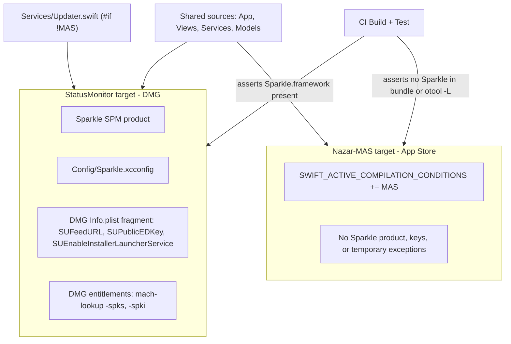
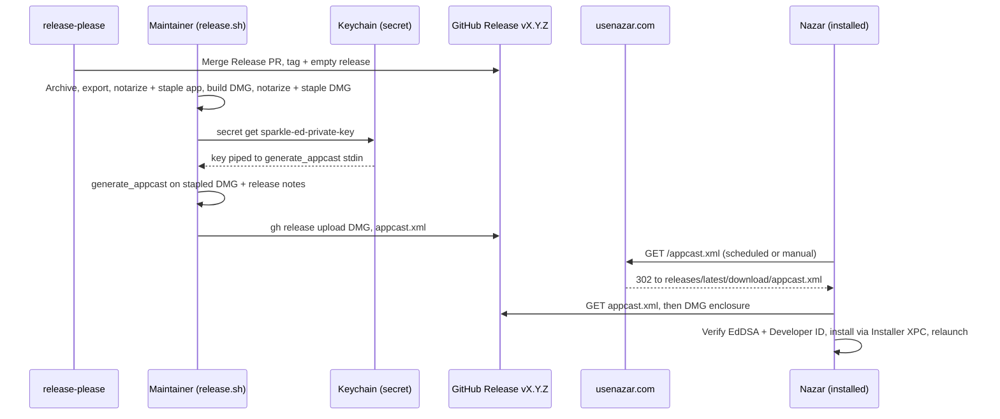

# Sparkle Auto-Updates - Plan

## Goal Capsule

- **Objective:** A person running the DMG build of Nazar learns that a newer version exists and installs it from inside the app, without downloading a DMG by hand.
- **Means:** Sparkle 2 in the DMG target only, fed by a signed appcast published with each GitHub release (KTD1, KTD6).
- **Authority:** Product Contract Requirements win on behavior. KTDs win on mechanism. Issue #44 comments are the upstream source.
- **Stop conditions:**
  - Stop before U1 is complete if the maintainer has not generated the EdDSA key pair. Only the maintainer runs key generation. The agent never reads, prints, or stores the private key.
  - Stop if the App Store target cannot build without Sparkle. That breaks R7 and the #60 plan.
  - Stop if a signed local update cannot install under the sandbox (U7 fails). Do not ship a release that users cannot update from.
- **Execution profile:** Mostly Xcode project config, build scripts, and CI. Prefer build and runtime smoke checks over unit tests, except in the updater and notification seams.
- **Tail ownership:** The maintainer runs the first real release (`scripts/release.sh` + `gh release upload`). The agent's work ends at a merged PR plus a passing local end-to-end update (U7).

---

## Product Contract

### Summary

Add Sparkle 2 to the DMG build so Nazar checks usenazar.com for updates, shows release notes, and installs with one click. Add a separate App Store target that compiles without Sparkle. Extend the release script to sign each DMG and publish an appcast next to it on the GitHub release.

### Problem Frame

Nazar ships as a notarized DMG on GitHub Releases. After install the app never checks for updates, so users stay on old versions unless they revisit the website or repo. Issue #44 chose Sparkle 2 over a lighter "check the GitHub Releases API" badge. Nazar is also going to the Mac App Store (#60). Apple does not allow App Store apps to update themselves, so Sparkle must be absent from that build. Version drift (#43) is fixed: `Config/Version.xcconfig` is the single version source and `scripts/release.sh` derives a strictly increasing `CFBundleVersion`, which Sparkle compares.

### Requirements

**Update experience (DMG build)**

- R1. On the second launch, Nazar asks once whether to check for updates automatically. This is Sparkle's default.
- R2. When a newer version exists, Nazar shows the version, release notes, and an Install button. Install downloads, verifies, replaces the app, and relaunches it.
- R3. The right-click status-bar menu has a "Check for Updates…" item that runs a manual check and reports "up to date" or an error.
- R4. An update found by a background check while Nazar is not in focus is surfaced without stealing focus. The user sees a system notification and an "Update Available…" menu label.
- R5. Debug builds and UI-test runs never start automatic update checks or show the permission prompt.

**Build split**

- R6. The DMG build embeds Sparkle and carries the feed URL, public key, and sandbox installer settings.
- R7. The App Store build compiles no Sparkle code, links no Sparkle framework, and carries no Sparkle plist keys or temporary-exception entitlements.
- R8. CI builds both flavors and fails if the App Store app contains Sparkle or the DMG app does not.

**Release and publishing**

- R9. `scripts/release.sh` produces a signed `appcast.xml` for the release DMG, using the EdDSA private key from Keychain through `secret`.
- R10. The appcast lists the new version's build number, display version, minimum macOS version, EdDSA signature, release notes, and a download URL on the matching GitHub release.
- R11. `https://usenazar.com/appcast.xml` always resolves to the latest release's appcast.
- R12. The private key never enters the repo, CI, logs, or disk outside Keychain.

### Key Decisions

- **Sparkle's standard prompt-and-install UI.** (session-settled: user-approved — chosen over silent background install and notify-only: users see what changed and nothing installs without consent.) Governs R1, R2, R3.
- **Separate App Store target without Sparkle.** (session-settled: user-approved — chosen over one target with MAS build configurations and over a compile flag only: follows DuckDuckGo's macOS app and uses normal Swift package linking.) Governs R6, R7, R8.
- **Appcast published as a release asset, served through a usenazar.com redirect.** (session-settled: user-approved — chosen over a script-written `website/appcast.xml` merged by PR each release and over a live feed built by a Cloudflare function: no per-release manual step, and the app only ever knows the usenazar.com URL.) Governs R9, R11.

### Acceptance Examples

- AE1. **Covers R1.** Given a fresh install, when the user launches Nazar the first time, then no update prompt appears. When they launch it a second time, Sparkle asks whether to check automatically.
- AE2. **Covers R3.** Given the installed build is the latest, when the user picks "Check for Updates…", then Sparkle reports that Nazar is up to date.
- AE3. **Covers R4.** Given automatic checks are on and Nazar has run in the background for a day, when a newer appcast item appears, then a notification says the new version is available and the menu item reads "Update Available…". Clicking either opens Sparkle's update window.
- AE4. **Covers R3, R11.** Given release-please has published a release but the appcast is not uploaded yet, when the user checks manually, then Sparkle shows a feed error and nothing installs.

### Scope Boundaries

- No App Store signing, provisioning, entitlements review, or listing work. That is #60.
- No bundle ID change. Sparkle ships under `com.moollapps.StatusMonitor`. The bridge release for `com.moollapps.Nazar` is #60.
- No delta updates, beta channel, signed feeds (`SURequireSignedFeed`), or automatic silent install.
- No update settings UI in the Settings window. Sparkle's permission prompt and the menu item cover R1 and R3.
- Users on v1.3.0 and earlier have no updater. They must install the first Sparkle release by hand. U6 covers the messaging.

#### Deferred to Follow-Up Work

- The repo-root `Info.plist` is copied into the app as a resource (`Contents/Resources/Info.plist`), not used as the app's Info.plist, and its values are stale. Remove or repurpose it in a separate change.
- `StatusMonitor.entitlements` is not referenced by `CODE_SIGN_ENTITLEMENTS`. The target uses generated `ENABLE_*` sandbox settings. Clean up after U1 settles which entitlements file is live.
- Automated Sparkle version bumps (Dependabot for Swift packages).

---

## Planning Contract

### Key Technical Decisions

- KTD1. **Add Sparkle through Swift Package Manager, pinned exactly to 2.9.6, linked to the DMG app target only.** Package products link per target, which is what makes the target split work. An exact pin matches DuckDuckGo's `AppUpdater/Package.swift` and keeps release tooling (`generate_appcast`) in step with the embedded framework.
- KTD2. **Per-target xcconfig, Info.plist, and entitlements, without an updater package.** Create `Config/Sparkle.xcconfig` (`SPARKLE_FEED_URL`, `SPARKLE_PUBLIC_EDKEY`), a DMG-only Info.plist fragment, and a DMG-only entitlements file. Put Sparkle code in one `Services/Updater.swift` wrapped in `#if !MAS`. (session-settled: user-approved — chosen over copying DuckDuckGo's `AppUpdater` local package with Sparkle and App Store implementations behind a protocol: one small updater file does not justify a package; YAGNI.) Sparkle keys are custom, so they cannot use `INFOPLIST_KEY_*` build settings. `GENERATE_INFOPLIST_FILE = YES` merges a target's `INFOPLIST_FILE` with the generated keys.
- KTD3. **Sandbox integration uses Sparkle's Installer XPC service and mach-lookup exception only.** Set `SUEnableInstallerLauncherService = YES`. Add `com.apple.security.temporary-exception.mach-lookup.global-name` with `$(PRODUCT_BUNDLE_IDENTIFIER)-spks` and `-spki` to the DMG entitlements. Do not enable the Downloader service: Nazar already has `com.apple.security.network.client`. Temporary exceptions stay out of the App Store target because App Review rejects them.
- KTD4. **The updater starts only in non-Debug, non-UI-test runs.** Create `SPUStandardUpdaterController` with `startingUpdater: false`, then start it when the build is not `DEBUG` and launch arguments lack `-UITestMode`. The start decision is a pure function so unit tests can cover it. The menu item works in every build so manual checks stay testable.
- KTD5. **Gentle reminders use a system notification plus a menu label.** Nazar runs as `.accessory`. Sparkle will not let a scheduled alert steal focus after launch and logs a warning unless `supportsGentleScheduledUpdateReminders` is implemented. Return `immediateFocus` from `standardUserDriverShouldHandleShowingScheduledUpdate`. Otherwise post a notification through the existing `NotificationService` and flip the menu title. A notification tap or menu click calls `checkForUpdates`, which brings up Sparkle's window. Clear the state in `standardUserDriverDidReceiveUserAttention` / `standardUserDriverWillFinishUpdateSession`. Chosen over Sparkle's default, where the alert opens behind other windows and is easy to miss. Also chosen over badging the status-bar icon, which already signals outage status and would mix two meanings. The notification reuses a surface users already allowed for outage alerts.
- KTD6. **Generate the appcast with Sparkle's `generate_appcast` from the final stapled DMG.** Stapling rewrites the DMG, so signing must happen after the step that staples the DMG, or the signature will not match the uploaded bytes. Pipe the key from `secret get sparkle-ed-private-key` into `--ed-key-file -`. Pass `--download-url-prefix https://github.com/moollaza/nazar/releases/download/v<version>/`, `--link https://usenazar.com`, and `--embed-release-notes`. Stage the DMG alone in a scratch folder with a `Nazar-<version>.md` notes file from the GitHub release body, so the appcast holds one item. Sparkle only needs the newest item.
- KTD7. **Locate Sparkle's tools through a fixed package directory.** Pass `-clonedSourcePackagesDirPath build/release/SourcePackages` to the archive step. The tools then sit at `build/release/SourcePackages/artifacts/sparkle/Sparkle/bin/`. No global install, no second Sparkle download, and the version always matches KTD1.
- KTD8. **Fail fast on missing release prerequisites.** Before archiving, `release.sh` checks `secret has sparkle-ed-private-key` and that `gh` can read the tag's release. A 20-minute notarization should not end in a missing-key error.
- KTD9. **The redirect is a 302 in `website/_redirects`.** `/appcast.xml` → `https://github.com/moollaza/nazar/releases/latest/download/appcast.xml`. GitHub's `latest/download` path returns 302 to the newest non-prerelease asset (verified against v1.3.0). Sparkle has no custom redirect handling, so `URLSession` follows redirects by default. Both hops are HTTPS.
- KTD10. **A lost EdDSA key is recoverable but still backed up.** Sparkle lets a Developer ID–signed app rotate its EdDSA key in an update signed with the same Developer ID certificate. The README still tells the maintainer to keep an offline backup (`generate_keys -x`), because rotation requires the Apple certificate to stay unchanged.

### High-Level Technical Design

**Build split.** One source tree, two app targets. Only the DMG target links Sparkle and carries its settings.

**Release and update sequence.** The appcast item only goes live after both assets are uploaded.

### Assumptions

- Xcode 26.6 merges a `CODE_SIGN_ENTITLEMENTS` file with the entitlements generated from `ENABLE_APP_SANDBOX` / `ENABLE_OUTGOING_NETWORK_CONNECTIONS`. U1 verifies this on the signed app. If it does not merge, the DMG entitlements file must restate the sandbox and network keys.
- `generate_appcast` 2.9.6 embeds a Markdown `.md` release-notes file with `--embed-release-notes`. If it does not, convert the body to minimal HTML in the script.
- Cloudflare serves `website/` with `_redirects` support. usenazar.com answers from Cloudflare, but the Pages project settings are not in the repo. U6 verifies the redirect after deploy.

---

## Implementation Units

### U1. Sparkle dependency and DMG target configuration

- **Goal:** The DMG app embeds Sparkle and carries a correct feed URL, public key, and sandbox installer settings.
- **Requirements:** R6, R12; KTD1, KTD2, KTD3.
- **Dependencies:** Maintainer has run key generation and handed over the public key (see Documentation / Operational Notes).
- **Files:**
  - `StatusMonitor.xcodeproj/project.pbxproj` (package reference, product dependency, `baseConfigurationReference`, `INFOPLIST_FILE`, `CODE_SIGN_ENTITLEMENTS` for the `StatusMonitor` target)
  - `Config/Sparkle.xcconfig` (new)
  - `Config/Sparkle-Info.plist` (new; DMG Info.plist fragment)
  - `Config/Nazar-DMG.entitlements` (new)
  - `StatusMonitorTests/UpdaterConfigurationTests.swift` (new)
- **Approach:**
  1. Add the Sparkle package at exactly 2.9.6. Link the `Sparkle` product to the `StatusMonitor` target only.
  2. `Config/Sparkle.xcconfig` includes `Version.xcconfig` and sets `SPARKLE_FEED_URL = https:/$()/usenazar.com/appcast.xml` plus the committed public key. The `$()` stops xcconfig from reading `//` as a comment, as DuckDuckGo's `Sparkle.xcconfig` does.
  3. Make `Sparkle.xcconfig` the target-level base configuration for both `StatusMonitor` configurations. The project-level base stays `Version.xcconfig`.
  4. The Info.plist fragment maps `SUFeedURL`, `SUPublicEDKey`, and `SUEnableInstallerLauncherService` to build settings.
  5. The entitlements file holds the KTD3 mach-lookup exception.
- **Patterns to follow:** `Config/Version.xcconfig` (comment style, single source); DuckDuckGo `macOS/Configuration/App/Sparkle.xcconfig`.
- **Test scenarios:**
  - Happy path: the test host app bundle's `SUFeedURL` equals `https://usenazar.com/appcast.xml`.
  - Happy path: `SUPublicEDKey` base64-decodes to exactly 32 bytes.
  - Happy path: `SUEnableInstallerLauncherService` is `true`.
  - Edge case: `CFBundleShortVersionString` still matches `MARKETING_VERSION` after the base-configuration change. This guards the #43 fix.
- **Verification:** `codesign -d --entitlements -` on a signed build shows sandbox, network client, and both mach-lookup names. `Nazar.app/Contents/Frameworks/Sparkle.framework` exists.

### U2. Updater service and menu item

- **Goal:** The DMG app starts Sparkle under the right conditions and exposes "Check for Updates…" in the right-click menu.
- **Requirements:** R1, R2, R3, R5; KTD2, KTD4.
- **Dependencies:** U1.
- **Files:**
  - `Services/Updater.swift` (new; whole file inside `#if !MAS`)
  - `StatusMonitorApp.swift` (`AppDelegate` owns the updater; `showContextMenu` adds the item)
  - `StatusMonitorTests/UpdaterTests.swift` (new)
- **Approach:**
  1. `Updater` is `@MainActor`, owns one `SPUStandardUpdaterController` created with `startingUpdater: false`, and acts as its user-driver delegate (U3 fills in the reminder methods).
  2. A pure start-policy function decides from `isDebugBuild` and launch arguments (KTD4). `AppDelegate` calls `start` after existing setup in `applicationDidFinishLaunching`.
  3. `showContextMenu` inserts the item after "About Nazar". The item's target is the updater controller, not `self`, so it must be added after the loop that sets `target = self`, or the loop must skip it. Its enabled state follows `updater.canCheckForUpdates`.
  4. The menu code for the item sits inside `#if !MAS`.
- **Patterns to follow:** `NotificationService` dependency style (`NotificationServicing` protocol for test seams); the existing `-UITestMode` checks in `applicationDidFinishLaunching`.
- **Test scenarios:**
  - Happy path: start policy returns `true` for a release build with no test arguments.
  - Edge case: start policy returns `false` when `isDebugBuild` is `true`.
  - Edge case: start policy returns `false` when arguments contain `-UITestMode`, in a release build too.
  - Integration: the context menu built by the app delegate contains "Check for Updates…" directly after "About Nazar", and its target is not the app delegate.
  - Error path: while an update session is in progress (`canCheckForUpdates` is `false`), the menu item is disabled.
- **Verification:** A Release build launched twice shows Sparkle's permission prompt on the second launch (AE1). The Debug build and the UI test suite never show it.

### U3. Gentle update reminder

- **Goal:** Background-found updates reach the user through a notification and menu label instead of an alert hidden behind other windows.
- **Requirements:** R4; KTD5.
- **Dependencies:** U2.
- **Files:**
  - `Services/Updater.swift` (gentle reminder delegate methods, `updateAvailableVersion` state)
  - `Services/NotificationService.swift` (update notification request builder, response routing)
  - `StatusMonitorApp.swift` (menu title reflects state)
  - `StatusMonitorTests/NotificationServiceTests.swift` (extend)
  - `StatusMonitorTests/UpdaterTests.swift` (extend)
- **Approach:**
  1. `supportsGentleScheduledUpdateReminders` returns `true`. `standardUserDriverShouldHandleShowingScheduledUpdate` returns `immediateFocus`.
  2. When Sparkle hands off the update, set `updateAvailableVersion` and ask `NotificationService` to post an update notification with its own identifier and category, separate from outage alerts.
  3. Notification response handling routes the update category to the updater's `checkForUpdates`. Outage notification handling is unchanged.
  4. Clear state when Sparkle reports user attention or the session finishes.
  5. Notification code that references the updater sits inside `#if !MAS`. The request builder can stay shared because it holds no Sparkle types.
- **Patterns to follow:** `NotificationService.makeRequest` / `makeBody` (nonisolated static builders tested without `UNUserNotificationCenter`).
- **Test scenarios:**
  - Happy path: the update request builder produces title "Nazar <version> is available", the update category, and a stable identifier per version.
  - Edge case: two reminders for the same version reuse one identifier, so macOS replaces the notification rather than stacking it.
  - Happy path: the delegate returns `true` for `immediateFocus = true` and `false` for `immediateFocus = false`.
  - Integration: a response with the update category calls the injected updater's check method once. A response with an outage category does not.
  - Edge case: after the attention callback, `updateAvailableVersion` is `nil` and the menu title returns to "Check for Updates…".
  - Error path: when notification authorization is denied, no request is added, and the menu title still changes to "Update Available…".
- **Verification:** With `SULastCheckTime` set to one day minus 30 seconds and a newer local feed (U7), the notification appears within about a minute and clicking it opens Sparkle's update window (AE3).

### U4. App Store target and CI guard

- **Goal:** A second app target builds the same app with no Sparkle, and CI proves both flavors stay correct.
- **Requirements:** R7, R8; KTD2.
- **Dependencies:** U2, U3 (the `#if !MAS` boundaries must exist before the MAS target compiles).
- **Files:**
  - `StatusMonitor.xcodeproj/project.pbxproj` (new `Nazar-MAS` native target with the same source and resource membership, no package product, `SWIFT_ACTIVE_COMPILATION_CONDITIONS` including `MAS`)
  - `StatusMonitor.xcodeproj/xcshareddata/xcschemes/Nazar-MAS.xcscheme` (new shared scheme)
  - `Config/MAS.xcconfig` (new; includes `Version.xcconfig`, sets the compilation condition)
  - `.github/workflows/ci.yml` (build step for `Nazar-MAS`, bundle assertions for both flavors)
- **Approach:**
  1. Duplicate the `StatusMonitor` target's build settings, then remove the Sparkle product, the Info.plist fragment, and the DMG entitlements. Create the target with a tool that understands the project format, such as the `xcodeproj` Ruby gem in an uncommitted scratch script or Xcode's Duplicate command. Avoid hand-writing pbxproj object IDs. Delete any generated "copy" Info.plist. Confirm the result with `xcodebuild -list`.
  2. Keep bundle ID and signing identical to the DMG target for now. #60 owns App Store identity and signing. CI builds with `CODE_SIGNING_ALLOWED=NO`.
  3. The project uses classic groups, not synchronized folders, so every Swift file must be a member of both targets. The MAS CI build catches a missing referenced file.
  4. CI asserts that the DMG `Nazar.app` contains `Contents/Frameworks/Sparkle.framework`. It asserts that the MAS app has no `Sparkle.framework`, no `Sparkle` in `otool -L` of the executable, and no `SUFeedURL` key.
  5. The `Build + Test` job has `timeout-minutes: 15` and already runs a build plus unit and UI tests. Measure the job after adding the MAS build and Sparkle package resolution. Raise the timeout only if a green run comes within 3 minutes of the limit.
- **Execution note:** Mostly project and CI config. Prove it with the two CI builds and bundle assertions, not unit tests.
- **Test expectation:** none -- target and CI config; the CI bundle assertions are the proof.
- **Verification:** The `Build + Test` job passes with both builds. A deliberate `import Sparkle` outside `#if !MAS` fails the MAS build locally.

### U5. Release script: sign and generate the appcast

- **Goal:** One `scripts/release.sh` run produces a notarized DMG and a matching signed `appcast.xml`.
- **Requirements:** R9, R10, R12; KTD6, KTD7, KTD8.
- **Dependencies:** U1.
- **Files:**
  - `scripts/release.sh`
  - `.github/workflows/release-please.yml` (next-steps notice uploads both files)
- **Approach:**
  1. Preflight before archiving (KTD8): `secret` wrapper present, `secret has sparkle-ed-private-key`, and `gh release view v$VERSION` succeeds.
  2. Archive with `-clonedSourcePackagesDirPath` (KTD7).
  3. Add a step 7 after DMG stapling: stage the DMG and a notes file from the release body, pipe the key into `generate_appcast`, and write `build/release/appcast.xml` (KTD6).
  4. Post-check the appcast: exactly one item, `sparkle:version` equals `$BUILD`, `sparkle:shortVersionString` equals `$VERSION`, the enclosure URL ends in `v$VERSION/Nazar-$VERSION.dmg`, and an `sparkle:edSignature` is present. Fail otherwise.
  5. Under `--skip-notarize`, still generate the appcast so the pipeline is testable, and print that it must not be uploaded.
  6. The final banner prints the single `gh release upload` command with the DMG and `appcast.xml`.
  7. Never assign the key to a shell variable. Pipe it only (secrets skill rule).
- **Patterns to follow:** Existing step banners, `✗` failure style, and the version-drift backstop in `scripts/release.sh`.
- **Test expectation:** none -- shell release tooling with no test harness in repo; the built-in post-check (step 4) and U7 dry run are the proof.
- **Verification:** `scripts/release.sh --skip-notarize` on a tag checkout produces `appcast.xml` that passes the post-check. With the key entry removed, the script fails in preflight within seconds.

### U6. Feed redirect, docs, and first-release messaging

- **Goal:** usenazar.com serves the feed URL, maintainers know the new release steps, and v1.3.0 users know to update by hand once.
- **Requirements:** R11; KTD9, KTD10.
- **Dependencies:** U5.
- **Files:**
  - `website/_redirects` (new)
  - `README.md` (Releasing: one-time key setup, backup, upload both files)
  - `CLAUDE.md` (Key Conventions: two app targets, add new files to both, `#if !MAS`; Deployment: appcast flow)
  - `website/index.html` (short note near download: versions 1.3.0 and earlier need one manual update)
- **Approach:**
  1. One redirect rule, status 302 (KTD9).
  2. README key setup: run `generate_keys` from `build/release/SourcePackages/artifacts/sparkle/Sparkle/bin/`, export with `-x` to a temp file, `secret put sparkle-ed-private-key` from that file, delete the temp file, and keep an offline backup. Paste the public key into `Config/Sparkle.xcconfig`.
  3. CLAUDE.md changes stay one line each.
- **Test expectation:** none -- static redirect and documentation.
- **Verification:** After the website deploys, `curl -sI https://usenazar.com/appcast.xml` returns 302 with the GitHub `latest/download` location. Before the first Sparkle release uploads its appcast, that location 404s, which is expected (AE4).

### U7. Local end-to-end update rehearsal

- **Goal:** Prove a sandboxed, Developer ID–signed Nazar installs a signed update before any user depends on it.
- **Requirements:** R2, R3, R4; KTD3, KTD6.
- **Dependencies:** U1, U2, U3, U5.
- **Files:** none committed. Scratch builds and a local feed only.
- **Approach:**
  1. Build an "old" signed Release app with a lower `CURRENT_PROJECT_VERSION` and `SPARKLE_FEED_URL` overridden at build time to a local test feed.
  2. Build a "new" DMG and appcast through `scripts/release.sh --skip-notarize` with a higher build number, and serve both locally.
  3. Run the old app from `/Applications`, check manually, install, and confirm it relaunches as the new build.
  4. Repeat the background path with `SULastCheckTime` set back a day to exercise U3.
- **Execution note:** Runtime smoke test. If the local feed is blocked by App Transport Security over plain HTTP, serve it over HTTPS or use a GitHub draft pre-release as the host. Record which one worked in the PR.
- **Test expectation:** none -- manual rehearsal; results recorded in the PR description.
- **Verification:** The old app relaunches reporting the new `CFBundleVersion`. Console shows no sandbox or XPC errors from Sparkle.

---

## Verification Contract

| Gate | Command or check | Proves |
|---|---|---|
| DMG build | `xcodebuild -project StatusMonitor.xcodeproj -scheme StatusMonitor -configuration Debug -destination 'platform=macOS' CODE_SIGNING_ALLOWED=NO build` | U1, U2, U3 compile |
| Unit tests | `xcodebuild -project StatusMonitor.xcodeproj -scheme StatusMonitor -destination 'platform=macOS' -only-testing:StatusMonitorTests CODE_SIGNING_ALLOWED=NO test` | U1–U3 scenarios |
| MAS build | `xcodebuild -project StatusMonitor.xcodeproj -scheme Nazar-MAS -configuration Release -destination 'generic/platform=macOS' CODE_SIGNING_ALLOWED=NO build` | R7 |
| Flavor assertions | CI step from U4 | R8 |
| UI tests | Existing `StatusMonitorUITests` step | R5 (no Sparkle prompt breaks UI tests) |
| Release dry run | `scripts/release.sh --skip-notarize` from a tag checkout | R9, R10 post-check |
| Entitlements | `codesign -d --entitlements - build/release/export/Nazar.app` | KTD3 |
| End-to-end | U7 rehearsal | R2, R3, R4 |
| Redirect | `curl -sI https://usenazar.com/appcast.xml` after deploy | R11 |

---

## Definition of Done

- All Verification Contract gates pass, and U7 results are written in the PR description.
- CI `Build + Test` is green with both app flavors.
- No Sparkle symbol, framework, plist key, or temporary exception appears in the `Nazar-MAS` product.
- The EdDSA private key exists only in the maintainer's Keychain and offline backup. `git grep` for the private key finds nothing, and no CI secret was added.
- README, CLAUDE.md, and the website note describe the new release and target conventions.
- No abandoned experiments remain in the diff: no leftover test feeds, scratch plists, or commented-out updater code.
- The PR closes #44.

---

## System-Wide Impact

- **Notifications:** `NotificationService` is the single `UNUserNotificationCenter` delegate. Update notifications add a second category to the same response handler, and outage handling must stay unchanged (U3 integration scenario).
- **UI tests:** `-UITestMode` wipes the app's defaults domain each run, which also clears Sparkle's stored state. KTD4 keeps the updater stopped there, so no Sparkle window can block XCUITest.
- **CI:** A second app build and a Swift package download add time to the required `Build + Test` check on `main` (U4 step 5).
- **Release operations:** Each release gains one upload file and a Keychain dependency on the maintainer's machine (U5, Documentation / Operational Notes).

---

## Risks & Dependencies

| Risk | Mitigation |
|---|---|
| An attacker who controls usenazar.com, the redirect, or the GitHub release swaps the appcast or DMG | Sparkle installs only archives with a valid EdDSA signature from the embedded public key, and checks the Developer ID signature. The private key stays in Keychain (R12), so a hijacked feed can offer a download but cannot get it installed |
| Theft of the maintainer's Keychain key plus GitHub access | Out of reach of repo controls. Keep the key off CI (R12) and in an offline backup only. Rotation (KTD10) recovers from key loss, not key theft plus a compromised Developer ID |
| Generated sandbox entitlements do not merge with the DMG entitlements file, so the installer XPC connection fails at update time | U1 inspects signed entitlements; U7 proves a real install before merge |
| Signature computed before DMG stapling no longer matches the uploaded file | KTD6 orders appcast generation after stapling; U5 post-check plus U7 install |
| A new source file lands in only one target | MAS CI build (U4); CLAUDE.md convention (U6) |
| Release published but appcast not yet uploaded (`latest` points at a release without the asset) | Only manual checks show an error; background checks fail quietly; release-please notice lists both uploads (U5) |
| Bundle ID switch in #60 breaks Sparkle updates | Out of scope here; #60 plans a bridge release shipped through Sparkle before the ID changes |
| The first Sparkle release cannot reach v1.3.0 users automatically | U6 website note and release notes |

---

## Documentation / Operational Notes

**One-time maintainer setup (blocks U1 completion; the maintainer runs it, not the agent):**

1. Resolve Sparkle once (open the project in Xcode or run any `xcodebuild` with `-clonedSourcePackagesDirPath build/release/SourcePackages`).
2. Run `generate_keys`, then `generate_keys -x <tempfile>`; store it with `secret put sparkle-ed-private-key < <tempfile>`; delete the temp file; keep an offline backup.
3. Share only the printed public key. It goes into `Config/Sparkle.xcconfig` and is safe to commit.

**Release flow after this ships:** merge the release-please PR → `git checkout vX.Y.Z` → `scripts/release.sh` → `gh release upload vX.Y.Z build/release/Nazar-X.Y.Z.dmg build/release/appcast.xml`.

---

## Sources & Research

- Issue #44 and its decision comments; #43 (closed, version single source); #60 (App Store, bundle ID bridge).
- DuckDuckGo `duckduckgo/apple-browsers`: `macOS/Configuration/App/DuckDuckGo.xcconfig`, `DuckDuckGoAppStore.xcconfig`, `Sparkle.xcconfig`, `macOS/LocalPackages/AppUpdater/Package.swift` (Sparkle pinned `exact: "2.9.6"`).
- Sparkle docs: [Sandboxing](https://sparkle-project.org/documentation/sandboxing/), [Programmatic setup](https://sparkle-project.org/documentation/programmatic-setup/), [Publishing](https://sparkle-project.org/documentation/publishing/), [Gentle reminders](https://sparkle-project.org/documentation/gentle-reminders/), [Rotating signing keys](https://sparkle-project.org/documentation/#rotating-signing-keys).
- Sparkle source: `generate_appcast/main.swift` (`--ed-key-file -`, `--download-url-prefix`, `--embed-release-notes`).
- Repo: `StatusMonitorApp.swift` `showContextMenu` and `-UITestMode` handling; `Services/NotificationService.swift` static request builders; `scripts/release.sh` step structure; `.github/workflows/ci.yml` `Build + Test` job (required check on `main`).
